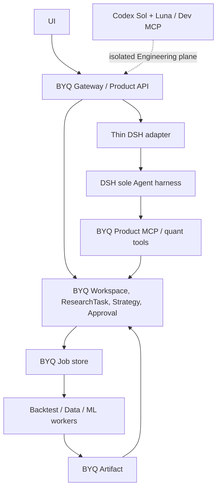

# Functional fidelity, risks and Phase 7–17 order

Status: acceptance plan, not completed feature evidence. All scenarios use a fresh BYQ schema and new Workspace. Historic sessions, Jobs and data do not count.

## Target boundary

## Functional fidelity matrix

| Capability | New-state evidence required | Scenario |
|---|---|---|
| Single-turn market analysis; multi-turn research | Product API/DSH conversation, persisted ResearchTask | A |
| Web Search; TuShare | real qualified tool calls, source/provenance, bounded outputs | A |
| Research Artifact; Interaction | stable Artifact ID, user interaction through Product API | A |
| Delegated research | actual DSH subagent and normalized BYQ projection | A |
| Multi-round backtest; long BacktestJob | two real Job IDs, worker completion, persisted results | B |
| Parameter optimization; result comparison | real optimization Job, comparison Artifact | B |
| TrainingJob; GPU Worker; ML checkpoint/restart | worker execution and model Artifact, restart evidence | C |
| Agent interruption; Job continuation/relink | DSH session disappears while Job completes; resumed Agent queries same job ID | D |
| Approval AUTO/DECISION/ACTION | allowed read, user choice, exact action gate and audit | A/B/C |
| Audit Event | structured event with request/workspace/resource/job identity | A/B/C |
| Reset Runtime; Reset Workspace | scoped, idempotent cleanup with protected global state intact | E |
| `dev-clean → init → start → seed → test` | clean rebuild from templates on isolated stack | F |

## Golden scenarios

- **A — Market Research:** new Workspace → ResearchTask → TuShare + Web Search → multi-turn interaction and DSH delegated research → Research Artifact; verify provenance, Product API and normalized trace.
- **B — Multi-round Backtest:** Agent starts BacktestJob A → Artifact → strategy change → BacktestJob B → optimization/comparison → comparison Artifact; verify Job IDs and approval boundaries.
- **C — ML:** Agent starts TrainingJob → GPU Worker → worker checkpoint/restart → model and metrics Artifacts; verify Agent does not own GPU process.
- **D — Session interruption:** Agent starts Job → DSH session disappears → Job completes → restored Agent uses same job ID and result Artifact; verify no duplicate Job.
- **E — Workspace Reset:** create research/jobs/artifacts → Reset Runtime → Reset Workspace → verify scoped clean state and preserved account/RBAC/global config → seed → rerun A.
- **F — Full rebuild:** `dev-clean --dry-run` scope review → `dev-clean` → `dev-init` → `dev-start` → `dev-seed` → Golden tests on fresh database.

## Risks and gates

| Risk | Gate / evidence |
|---|---|
| Current STATUS/Accepted ADRs still authorize 0.9 P4 and freeze 0.10 | New ADR acceptance, STATUS/ARCHITECTURE/AGENTS supersession before Phase 7 |
| Unknown actual DB/backup/volume and unrelated running test containers | identify owner, final verified archive manifest before any DB/container cleanup |
| DSH 0.1.5-rc.1 API may lack required native continuity | qualify exact API/version and expose limitation; do not rebuild generic recovery |
| P4 safety logic mixed with generic runtime | preserve business CAS/approval/unknown-outcome tests before removing generic components |
| Event ledger currently carries durable commands | move pending command to business state/Job before event deletion |
| Audit tables may contain authoritative financial facts | classify table by table; keep facts, move only observation to emitter |
| Job table unification may become a new workflow abstraction | common contract and IDs first; keep specialized worker stores if simpler |
| GPU/real Tushare/browser credentials and hardware unavailable in ordinary CI | separate keyless contract gate from qualified real Golden evidence; do not mark full fidelity PASS without real flow |
| 144 worktrees / four dirty and rollback images | exact ownership checks; never broad prune or touch P4 branch |

## Implementation sequence after planning gate

Each phase uses one isolated branch/worktree and required human PR gate unless a newly accepted ADR changes it. Each step ends Tester → independent Sol Reviewer → Root PASS before the next begins. The [development verification gate](verification-gates.md) defines risk-selected slice evidence, Phase 9 command/service qualification, and Phase 15–16 full rebuild and Golden milestones; historical-data restoration and repeated full-suite runs are not per-slice gates.

7. Remove duplicate Agent/session/child/runtime recovery in bounded vertical slices. Delete dead code first; for live paths, cut over directly to an existing DSH translation or existing BYQ Job/Worker in the same slice and pass public contract tests. Do not leave an interim broken public path or add a compatibility bridge.
8. Archive verified old DB, then clean only classified old BYQ containers/volumes/networks/images in inventory order.
9. Build scoped dev lifecycle, templates, profiles and minimal seed; prove `dev-clean` dry run.
10. Qualify current DSH API and implement thin adapter with contract/error/cancel tests.
11. Establish common Job ID/state contract and worker-backed backtest, training, optimization, factor and data-import paths.
12. Normalize Artifact IDs, three-level Approval and structured Audit; retain domain fact records.
13. Implement scoped, idempotent Reset Runtime and Reset Workspace.
14. Establish fresh schema baseline and seed; old DB remains archive only.
15. Verify full functional fidelity from empty schema/workspace via real Product API and browser where UI applies.
16. Run Golden Scenarios A–F, including GPU/credential-qualified paths and restart evidence.
17. Search and delete residual duplicate owner, compatibility, generic workflow, event-as-state, Agent-owned compute and dev-tool leakage; rerun contract and Golden gates.

No Phase 7 destructive refactor begins before Phase 0–6 gate and accepted ADR. Full 0.10 completion requires the real functionality evidence above; this planning package makes no such claim.
